# 🦌⚡ KeyRing Signer Agent

Autonomous agent signers for the KeyRing protocol on Hedera network.

## Overview

The KeyRing Signer Agent is an autonomous agent that monitors Hedera HCS topics for scheduled transactions requiring multi-signature approval. The agent automatically signs approved transactions based on project verification and validation rules.

This prototype includes:
- **Backend Agent:** Autonomous signer that monitors and signs transactions
- **API Server:** REST API for dashboard communication
- **Dashboard:** Next.js web interface for monitoring and control

## Architecture

```mermaid
graph TB
    subgraph Hedera["🌐 HEDERA NETWORK (Testnet)"]
        subgraph HCS["📋 HCS TOPICS"]
            Registry["PROJECT_REGISTRY_TOPIC<br/>Project metadata & verification"]
            Contracts["PROJECT_CONTRACTS_TOPIC<br/>Smart contract ABIs"]
            Audit["PROJECT_AUDIT_TOPIC<br/>Audit reports"]
            Validator["PROJECT_VALIDATOR_TOPIC<br/>Validation results"]
            Rejection["PROJECT_REJECTION_TOPIC<br/>Rejected transactions"]
        end
        
        subgraph Accounts["💰 ACCOUNTS & TRANSACTIONS"]
            Threshold["THRESHOLD ACCOUNT<br/>Multi-sig (2-of-3)<br/>Agent + Operators"]
            Scheduled["SCHEDULED TRANSACTIONS<br/>Pending multi-sig TXs<br/>Auto-execute when threshold met"]
        end
        
        Mirror["🔍 MIRROR NODE REST API<br/>Query topics, schedules, accounts"]
    end
    
    subgraph Agent["🤖 KEYRING SIGNER AGENT"]
        direction TB
        LangChain["LangChain + GPT-4o<br/>AI Decision Engine"]
        Tools["Custom Tools<br/>• Query Registry<br/>• Fetch Pending TX<br/>• Get Schedule Info<br/>• Sign Transaction"]
        SDK1["Hedera SDK<br/>Client & Signing"]
        
        LangChain --> Tools
        Tools --> SDK1
    end
    
    subgraph Dashboard["🖥️ NEXT.JS DASHBOARD"]
        direction TB
        Frontend["React Frontend<br/>• Project Info<br/>• Threshold View<br/>• TX Monitoring<br/>• Signature Status"]
        API["API Routes<br/>• /api/project<br/>• /api/threshold<br/>• /api/transactions<br/>• /api/stats"]
        SDK2["Hedera SDK<br/>Queries"]
        
        Frontend --> API
        API --> SDK2
    end
    
    %% Data flows
    Registry -.->|1. Load project| Agent
    Contracts -.->|2. Load ABIs| Agent
    Scheduled -->|3. Fetch pending| Agent
    Agent -->|4. Post validation| Validator
    Agent -->|5. Post rejection| Rejection
    Agent -->|6. Sign TX| Scheduled
    
    Mirror -->|Query data| Dashboard
    Registry -.->|Project info| Dashboard
    Threshold -.->|Account details| Dashboard
    Scheduled -.->|TX status| Dashboard
    
    Threshold -->|Creates| Scheduled
    
    classDef hederaClass fill:#0066cc,stroke:#003d7a,color:#fff
    classDef agentClass fill:#22c55e,stroke:#16a34a,color:#fff
    classDef dashboardClass fill:#8b5cf6,stroke:#7c3aed,color:#fff
    classDef topicClass fill:#06b6d4,stroke:#0891b2,color:#fff
    
    class Hedera,Mirror,Accounts hederaClass
    class Agent,LangChain,Tools,SDK1 agentClass
    class Dashboard,Frontend,API,SDK2 dashboardClass
    class HCS,Registry,Contracts,Audit,Validator,Rejection topicClass
```



### Workflow

**1. Project Setup**
   - Project registers on HCS registry topic with metadata
   - Smart contract ABIs submitted to contracts topic
   - Threshold account created with agent as co-signer

**2. Agent Initialization**
   - Loads project data from HCS topics
   - Reviews smart contract ABIs for validation rules
   - Identifies project operator account ID

**3. Transaction Creation**
   - Project operator creates scheduled transaction
   - Posted to Hedera network requiring N-of-M signatures

**4. Agent Monitoring**
   - Fetches pending transactions from operator
   - Gets detailed schedule info (decoded parameters)
   - Validates against contract rules & security checks

**5. Validation & Signing**
   - Posts validation result to validator topic
   - **IF SAFE:** Agent signs transaction
   - **IF UNSAFE:** Posts rejection to rejection topic

**6. Execution**
   - When threshold met, transaction auto-executes
   - All activity logged on-chain

**7. Dashboard Monitoring**
   - Real-time view of project details from HCS topics
   - Threshold account configuration display
   - Transaction status and signature tracking
   - Test transaction controls

## Features

### Dashboard
- ✅ **Project Information:** View verified project details from HCS topics
- ✅ **Threshold Account:** Display multi-sig account configuration and authorized signers
- ✅ **Transaction Monitoring:** Real-time view of scheduled transactions and their status
- ✅ **Signature Tracking:** See which transactions are pending, signed, or rejected
- ✅ **Test Triggers:** Create test scheduled transactions for demonstration

### Backend Agent
- ✅ **Autonomous Signing:** Automatically signs approved transactions
- ✅ **HCS Topic Monitoring:** Listens to project registry and transaction topics
- ✅ **Multi-Signature Support:** Works with threshold key lists
- ✅ **LangChain Integration:** AI-powered decision making for transaction approval

## Quick Start

### Prerequisites

- Node.js 18+
- Hedera testnet account with HBAR
- OpenAI API key
- Configured threshold account with multiple signers

### Installation

```bash
# Clone repository
git clone <your-repo-url>
cd keyring-signer-agent

# Install backend dependencies
npm install

# Install dashboard dependencies
cd dashboard
npm install
cd ..
```

### Configuration

Create a `.env` file in the root directory:

```bash
# Hedera Network
HEDERA_NETWORK=testnet
HEDERA_ACCOUNT_ID=0.0.xxxxx
HEDERA_PRIVATE_KEY=302e020100300506032b657004220420...
OPERATOR_PUBLIC_KEY=302a300506032b6570032100...

# Project Configuration
PROJECT_REGISTRY_TOPIC=0.0.xxxxx
THRESHOLD_ACCOUNT_ID=0.0.xxxxx
LYNX_TESTNET_OPERATOR_ID=0.0.xxxxx

# API Configuration (for dashboard)
API_PORT=3001

# AI Configuration
OPENAI_API_KEY=sk-...

# Test Signers (optional)
TEST_SIGNER1=302a300506032b6570032100...
TEST_SIGNER2=302a300506032b6570032100...
```

Create `dashboard/.env.local`:

```bash
NEXT_PUBLIC_API_URL=http://localhost:3001
```

### Running Locally

**Terminal 1 - API Server:**
```bash
npm run api
```

**Terminal 2 - Dashboard:**
```bash
npm run dashboard
```

**Terminal 3 - Agent (optional):**
```bash
npm start
```

Open dashboard at [http://localhost:3000](http://localhost:3000)

## Project Structure

```
keyring-signer-agent/
├── src/
│   ├── agent/              # Agent implementation
│   │   ├── agent-config.ts
│   │   └── keyring-signer-agent.ts
│   ├── api/                # Express API server
│   │   └── server.ts
│   ├── tools/              # Agent tools
│   │   ├── fetch-pending-transactions.ts
│   │   ├── get-schedule-info.ts
│   │   ├── query-registry-topic.ts
│   │   └── sign-transaction.ts
│   ├── types/              # Shared TypeScript types
│   │   └── api.ts
│   ├── utils/              # Utility scripts
│   │   ├── createTestTransactions.ts
│   │   ├── createThreshold.ts
│   │   ├── projectTopic.ts
│   │   └── ...
│   └── index.ts            # Agent entry point
├── dashboard/              # Next.js dashboard
│   ├── app/                # App router pages
│   ├── components/         # React components
│   ├── lib/                # API client
│   └── types/              # Frontend types
├── package.json            # Backend dependencies
├── render.yaml             # Render deployment config
├── vercel.json             # Vercel deployment config
└── README.md
```

## Available Scripts

### Backend

```bash
npm start                   # Run the autonomous agent
npm run api                 # Run API server for dashboard
npm run project:register    # Register project on HCS topic
npm run project:contracts   # Submit contract info to topic
npm run project:audits      # Submit audit info to topic
npm run threshold:create    # Create threshold account
npm run test:transactions   # Create test scheduled transactions
```

### Dashboard

```bash
cd dashboard
npm run dev                 # Development server
npm run build              # Production build
npm start                  # Production server
```

## Deployment

See [DEPLOYMENT.md](./DEPLOYMENT.md) for detailed deployment instructions.

### Quick Deploy

**Backend (Render):**
1. Connect GitHub repository
2. Use `render.yaml` blueprint
3. Add environment variables
4. Deploy

**Dashboard (Vercel):**
1. Connect GitHub repository
2. Vercel detects `vercel.json`
3. Add `NEXT_PUBLIC_API_URL`
4. Deploy

## Dashboard Features

### Project Details Card
- Company name and legal entity
- Project owners
- Verification status
- Operator account ID
- Public record links

### Threshold Account Card
- Account ID and balance
- Threshold configuration (e.g., 2 of 3)
- List of authorized signer public keys
- Account memo

### Transactions List
- Schedule ID and status
- Creator and payer accounts
- Signature collection status
- Pending/signed/rejected/executed states
- Signature requirement indicators

### Stats Overview
- Total scheduled transactions
- Pending signatures count
- Signed transactions count
- Rejected transactions count

### Actions
- **Refresh:** Reload all data from API
- **Test Transactions:** Trigger creation of test scheduled transactions

## How It Works

1. **Project Registration:** Projects register on HCS-2 topic with verification data
2. **Threshold Account:** Multi-sig account created with agent as one of the signers
3. **Transaction Creation:** Project operator creates scheduled transactions
4. **Agent Monitoring:** Agent listens to topics and fetches pending transactions
5. **Signature Collection:** Agent signs approved transactions automatically
6. **Execution:** When threshold met, transaction executes on Hedera
7. **Dashboard Monitoring:** Real-time view of all activity via REST API

## Technologies

- **Hedera SDK:** Transaction signing and HCS topic monitoring
- **LangChain:** AI agent framework
- **OpenAI:** Language model for decision making
- **Express:** REST API server
- **Next.js 14:** React framework with App Router
- **TypeScript:** Type-safe development
- **Tailwind CSS:** Styling
- **Lucide Icons:** UI icons

## Testing

Create test scheduled transactions:

```bash
npm run test:transactions
```

Then view them in the dashboard or query via API:

```bash
curl http://localhost:3001/api/transactions
```

## Development Tips

- Use `.env` for backend configuration
- Use `dashboard/.env.local` for frontend configuration
- API auto-refreshes dashboard data every 30 seconds
- Check console logs for detailed agent activity
- Use Render/Vercel logs for production debugging

## Security Considerations

- Private keys stored in environment variables only
- Never commit `.env` files
- API CORS configured (restrict in production)
- Threshold accounts require multiple signers
- Transaction validation before signing

## Contributing

This is a prototype for demonstration purposes. For production use:
- Add comprehensive error handling
- Implement rate limiting on API
- Add authentication/authorization
- Set up monitoring and alerting
- Add comprehensive test coverage
- Implement proper logging

## License

ISC

## Author

Kevin Compton

## Support

For issues or questions:
- Check [DEPLOYMENT.md](./DEPLOYMENT.md) for deployment help
- Review [TEST_SCENARIOS.md](./TEST_SCENARIOS.md) for testing
- Check agent logs for detailed activity
- Verify environment variables are set correctly

